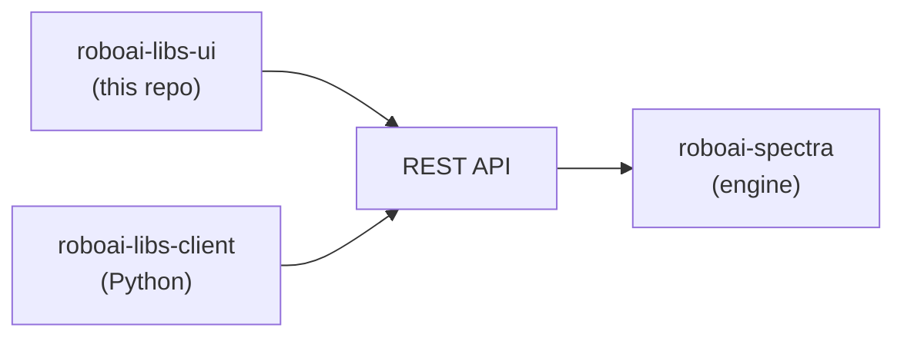

# RoboAI LIBS Spectrum Simulator — Web UI

[](https://github.com/RoboAI-Green/roboai-libs-ui/actions/workflows/ci.yml)
[](LICENSE)

The web frontend for the RoboAI LIBS Spectrum Simulator: an interactive single-page app for simulating laser-induced breakdown spectroscopy (LIBS) spectra in the browser. It talks to the RoboAI LIBS REST API over HTTP.

## Features

- **Static spectra** — Saha–Boltzmann equilibrium emission for arbitrary element mixtures, with adjustable electron temperature, density, and ionization stages.
- **Time-resolved exposure** — a time slider and a 3D time–wavelength–intensity surface for the plasma's temporal evolution.
- **Instrument broadening** — Gaussian / Lorentzian convolution with configurable FWHM.
- **Custom output grids** — sample the spectrum on your own wavelength grid.
- **Shareable state** — the full configuration lives in the URL, so any run is a link.

## Where this fits

The Web UI is one of two clients of the RoboAI LIBS platform. The platform exposes the `roboai-spectra` compute engine over a REST API; this browser app and the [`roboai-libs-client`](https://github.com/RoboAI-Green/roboai-libs-client) Python package ([PyPI](https://pypi.org/project/roboai-libs-client/)) both talk to that same API.



## Quick start

Prerequisites: **Node.js 24+** and **pnpm** (`corepack enable` provides it).

```bash
pnpm install
cp .env.local.example .env.local   # then edit — see "Connecting to the API" below
pnpm dev
```

The dev server runs on http://localhost:5173.

## Connecting to the API

The Web UI talks to a running RoboAI LIBS API and needs a per-user token. Get one with the built-in helper:

```bash
pnpm get-token
```

It emails you a verification link — click it, copy the access token it returns, and paste it back. The token is saved to `.env.local`; then start (or restart) `pnpm dev`. Without a token the UI loads, but compute requests fail.

<details>
<summary>Advanced: using a different backend</summary>

By default the dev server proxies API calls to `https://libs.roboai.fi`. Point it elsewhere with `API_PROXY_TARGET`, e.g. `API_PROXY_TARGET=http://localhost:8080 pnpm dev`. A token can also be obtained manually via the [roboai-libs-client](https://github.com/RoboAI-Green/roboai-libs-client) Python package (`roboai-libs auth login`).

</details>

## Scripts

| Command                             | What it does                                           |
| ----------------------------------- | ------------------------------------------------------ |
| `pnpm dev`                          | Start the Vite dev server with HMR.                    |
| `pnpm build`                        | Type-check and build the production bundle to `dist/`. |
| `pnpm preview`                      | Serve the built bundle locally.                        |
| `pnpm test`                         | Run the unit tests once (Vitest).                      |
| `pnpm test:watch`                   | Run tests in watch mode.                               |
| `pnpm lint`                         | Lint with oxlint.                                      |
| `pnpm format` / `pnpm format:check` | Format / check formatting with oxfmt.                  |

## Tech stack

| Area                | Technology                           | Role                                                                                                                         |
| ------------------- | ------------------------------------ | ---------------------------------------------------------------------------------------------------------------------------- |
| **Language**        | TypeScript (strict)                  | Static types catch bugs before runtime and double as documentation; no implicit `any`.                                       |
| **Framework**       | React 19 + React Compiler            | Declarative components; the compiler auto-memoizes, so no hand-written `useMemo`/`useCallback`.                              |
| **Build**           | Vite                                 | Native-ESM dev server with instant start and true HMR; bundles for production.                                               |
| **URL / app state** | TanStack Router                      | The simulator config _is_ the URL — type-safe, file-based routes and validated search params make any view a shareable link. |
| **Server state**    | TanStack Query                       | Manages the lifecycle of compute results from the API (loading, caching, refetch, job polling).                              |
| **Client state**    | Zustand                              | A tiny store for genuinely local state (chat, session, UI toggles) — no boilerplate.                                         |
| **Validation**      | Zod                                  | One schema validates URL params and assistant patches; the TypeScript mirror of the server's pydantic models.                |
| **Data**            | Apache Arrow                         | Decodes the compact columnar result payloads the API sends — fast to parse and slice for charting.                           |
| **Charts**          | Plotly (`react-plotly.js`)           | Publication-quality, interactive scientific charts: line spectra, 3-D surfaces, time-resolved panels.                        |
| **Styling**         | Tailwind CSS v4                      | Utility-first styling in markup — no separate CSS files to drift.                                                            |
| **Components**      | shadcn + Base UI                     | Accessible, unstyled primitives you own and style with Tailwind.                                                             |
| **Lint / format**   | oxlint / oxfmt (Oxc)                 | Rust-based, orders of magnitude faster than ESLint/Prettier for a fast feedback loop.                                        |
| **Testing**         | Vitest + Testing Library + happy-dom | Vite-native test runner; tests target user-visible behaviour, colocated next to code.                                        |

## Contributing

Contributions are welcome — see [CONTRIBUTING.md](CONTRIBUTING.md).

## Support

For bugs, questions, or feature requests, please open an issue on the
[GitHub repository](https://github.com/RoboAI-Green/roboai-libs-ui/issues).

## Citation

Yilin Wang, Shuo Zhang, Toni Aaltonen, Pekka Suominen, Eetu Ojanen,
An interactive online platform for the simulation and analysis of LIBS,
SoftwareX,
Volume 36,
2026,
103030,
ISSN 2352-7110,
https://doi.org/10.1016/j.softx.2026.103030.

## License

[MIT](LICENSE) © RoboAI Green
